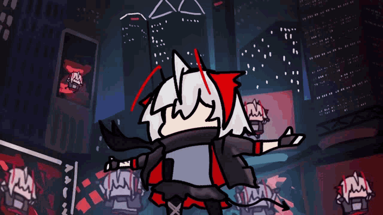

  

  <audio controls>
    <source src="https://raw.githubusercontent.com/BlackCandy001/BlackCandy001/main/w.mp3" type="audio/mpeg">
  </audio>

---

### 💫 Về tôi

Tôi là một người yêu thích sự khai thác và bào mòn công cụ đến hơi thở cuối cùng!

- 🔭 Tôi đang làm việc trên các dự án Open Source.
- 💜 Màu sắc yêu thích: Tím (Purple / Violet / Indigo).

---

### 🛠️ Kỹ năng của tôi

  

---

### 📊 Thống kê GitHub (Purple Theme)

  

  

  

